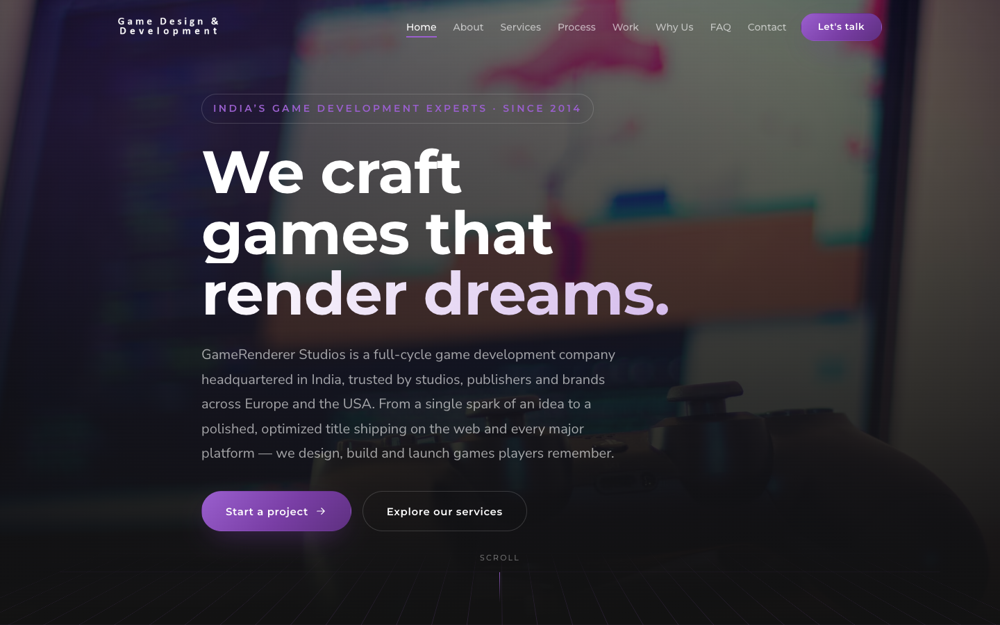

<div align="center">

# GameRenderer Studios

**Game development company in India — building Web (HTML5/WebGL) and Unity games for clients across Europe, the USA and worldwide.**

[](https://vuejs.org/)
[](https://vite.dev/)
[](https://github.com/JonasKruckenberg/imagetools)
[](src/assets/styles/variables.css)
[](#-license)



</div>

## Table of Contents

- [✨ Highlights](#-highlights) · [🚀 Quick Start](#-quick-start) · [🏗 Architecture](#-architecture)
- [🎨 Design System](#-design-system) · [🧊 3D Scenes](#-3d-scenes) · [🖼 Image Pipeline](#-image-pipeline) · [🔤 Typography](#-typography)
- [🔍 SEO](#-seo) · [♿ Accessibility](#-accessibility) · [⚡ Performance](#-performance)
- [📝 Editing Content](#-editing-content) · [🌐 Deployment](#-deployment) · [📜 License](#-license)

## ✨ Highlights

- **10 content sections** — hero, about, services, process + tech stack, work + clients, why us, industries, testimonials, FAQ, contact — composed from focused Vue SFCs
- **Live Three.js background scenes** — a wireframe poly cluster (hero), rotating atom (services) and orbiting solar system (why-us), lazy-loaded on desktop with static PNG fallbacks when WebGL is unavailable
- **CSS 3D micro-interactions** — perspective fold-in reveals, card tilts and a hero grid floor, tokenized via `--persp` / `--bevel`
- **Modern image pipeline** — `vite-imagetools` generates AVIF/WebP responsive `srcset`s at build time
- **Self-hosted variable fonts** — Montserrat + Nunito Sans `.woff2`, preloaded; zero third-party font requests
- **Extensive SEO** — tuned metadata, four inline JSON-LD blocks, plus a **build-time prerender** that injects a crawlable static HTML snapshot and FAQPage JSON-LD into `dist/`
- **WCAG AA** — accessible contrast tokens, reduced-motion support, full keyboard navigation
- **Lean runtime** — Vue + lazily-chunked Three.js only; icons are inline SVG, no UI framework, no CSS framework

## 🚀 Quick Start

Requires **Node.js 20+**.

```bash
npm install
npm run dev
```

| Script | Command | Description |
| --- | --- | --- |
| `npm run dev` | `vite` | Dev server with HMR at `http://localhost:5173` |
| `npm run build` | `vite build && node scripts/prerender.mjs` | Production build to `dist/`, then injects the prerendered HTML snapshot + FAQPage JSON-LD into `dist/index.html` |
| `npm run preview` | `vite preview` | Serve the production build locally |

## 🏗 Architecture

```
index.html                  # SEO head: meta, OG/Twitter, preloads, 4 JSON-LD blocks
scripts/
└── prerender.mjs           # build-time static HTML + FAQPage JSON-LD injector (pure Node, no deps)
public/                     # robots.txt, sitemap.xml, og-image.jpg, favicons, webmanifest
src/
├── main.js                 # app bootstrap + global v-reveal directive
├── App.vue                 # page composition (section order)
├── assets/
│   ├── fonts/              # self-hosted Montserrat + Nunito Sans (variable woff2)
│   ├── images/             # hero + studio photography, portfolio thumbnails
│   └── styles/
│       ├── fonts.css       # @font-face declarations (local fonts)
│       ├── variables.css   # design tokens (colors, type, spacing, 3D depth)
│       └── base.css        # reset, typography, layout helpers, buttons, reveals
├── data/
│   └── content.js          # ALL marketing copy (single source of truth)
├── composables/
│   ├── reveal.js           # v-reveal scroll-reveal directive (IntersectionObserver)
│   ├── useActiveSection.js # active-nav highlighting on scroll
│   └── useCountUp.js       # animated stat counters
├── three/
│   ├── webgl.js            # WebGL availability detection
│   └── scenes/             # poly.js, atom.js, solar.js — Three.js background scenes
└── components/
    ├── AppHeader.vue       # sticky nav + mobile drawer (Esc / backdrop to close)
    ├── BaseIcon.vue        # inline SVG icon set
    ├── Scene3D.vue         # lazy Three.js host: WebGL/PNG fallback, pause offscreen
    ├── HeroSection.vue     # LCP-optimized hero + perspective grid floor
    ├── AboutSection.vue    # studio story + stats
    ├── StatCounter.vue     # count-up number used by About
    ├── ServicesSection.vue # 9-service grid
    ├── ProcessSection.vue  # process steps + tech stack groups
    ├── WorkSection.vue     # portfolio tiles + clients wall
    ├── WhyUsSection.vue    # differentiators + engagement models
    ├── IndustriesSection.vue
    ├── TestimonialsSection.vue
    ├── FaqSection.vue      # accordion (source of the FAQPage JSON-LD)
    ├── ContactSection.vue  # contact channels + CTA
    ├── AppFooter.vue
    └── BackToTop.vue
```

## 🎨 Design System

Plain CSS with custom properties — every value lives in [`src/assets/styles/variables.css`](src/assets/styles/variables.css), so **re-theming is a single-file change**. Key tokens:

| Token | Value | Role |
| --- | --- | --- |
| `--color-bg` | `#121212` | Dark canvas (original brand) |
| `--color-accent` | `#793ea5` | Purple brand accent |
| `--font-display` | Montserrat | Headings / display type |
| `--font-body` | Nunito Sans | Body copy |
| `--persp` | `900px` | Shared vanishing point for all 3D tilt/fold effects |
| `--bevel` | inset top highlight | Light-catch edge on raised cards |

Global classes (`container`, `section`, `section-head`, `eyebrow`, `lead`, `btn`) live in [`base.css`](src/assets/styles/base.css); everything else is Vue-scoped per component.

## 🧊 3D Scenes

Three ambient Three.js scenes float in text-free zones as background art — a low-poly
wireframe cluster beside the hero headline, a rotating **atom** beside the services
heading, and an orbiting **solar system** beside the why-us heading. All hosted by
[`Scene3D.vue`](src/components/Scene3D.vue):

- **Lazy by design** — `three` ships as a separate async chunk, imported only when a
  scene scrolls near the viewport on desktop (≥ 1100px); mobile pays zero cost
- **Static PNG fallbacks** — real renders of each scene
  ([`src/assets/images/3d/`](src/assets/images/3d/)) shown when WebGL is unavailable
  or `prefers-reduced-motion` is set
- **Battery-friendly** — rendering pauses when a scene leaves the viewport or the tab
  is hidden; pixel ratio capped at 1.5; full dispose on unmount
- **Layered safely** — scenes sit at `z-index: 0` under content (`z-index: 1+`),
  `pointer-events: none`, with a radial mask for soft edge blending; placement is
  glyph-level verified not to overlap text at 1100/1280/1440/1920px

## 🖼 Image Pipeline

- Source JPEGs are converted to **AVIF + WebP** with responsive `srcset`s at build time by `vite-imagetools` (query imports like `?format=avif&w=768;1280&as=srcset`)
- Hero image: **348 KB JPEG → ~29 KB AVIF**
- The hero renders as `` for a fast LCP; all below-the-fold imagery uses `loading="lazy"`

## 🔤 Typography

- Montserrat (display) and Nunito Sans (body) are **self-hosted variable `.woff2`** files in [`src/assets/fonts`](src/assets/fonts) — no Google Fonts request at runtime
- The two critical fonts are **preloaded** from [`index.html`](index.html)
- `font-display: swap` keeps text visible during font load ([`fonts.css`](src/assets/styles/fonts.css))

## 🔍 SEO

Everything implemented, in one list:

- [x] Keyword-tuned `<title>` + meta description/keywords, `robots` meta with `max-image-preview:large`
- [x] Canonical URL + geo/business-locale meta (`geo.region`, `geo.placename`)
- [x] Open Graph + Twitter cards with a branded 1200×630 [`og-image.jpg`](public/og-image.jpg)
- [x] JSON-LD in [`index.html`](index.html): `Organization`, `WebSite`, `ProfessionalService` (full service catalog) and `WebPage`
- [x] **Build-time `FAQPage` JSON-LD** — generated from [`src/data/content.js`](src/data/content.js) by [`scripts/prerender.mjs`](scripts/prerender.mjs), so it never drifts from the visible FAQ
- [x] **Prerendered static HTML snapshot** — `scripts/prerender.mjs` renders the full page content into `dist/index.html` inside the `#app` mount, so crawlers get real HTML before any JavaScript runs (idempotent; runs automatically via `npm run build`)
- [x] [`robots.txt`](public/robots.txt) + [`sitemap.xml`](public/sitemap.xml) with image entries
- [x] Crawlable `<noscript>` fallback

> **Domain note:** canonical/OG/sitemap URLs assume `https://gamerenderer.com/`. If the production domain differs, update [`index.html`](index.html) (canonical, OG/Twitter URLs, JSON-LD `@id`s), [`public/sitemap.xml`](public/sitemap.xml) and [`public/robots.txt`](public/robots.txt).

## ♿ Accessibility

- WCAG **AA contrast** on text tokens (e.g. `--color-text-dim` ≈ 4.6:1 on `#121212`)
- Respects `prefers-reduced-motion` — reveals and tilts collapse to simple fades
- Mobile drawer nav is keyboard-friendly: **Esc to close**, backdrop click, focus management
- Semantic landmarks, `aria-*` on interactive controls, visible focus rings
- `scroll-padding-top` keeps anchored sections clear of the fixed header

## ⚡ Performance

Measured from the production build (gzip where noted):

| Asset | Size |
| --- | --- |
| JavaScript (main bundle) | ~43 KB gz |
| Three.js (lazy chunk, desktop-only, on scroll) | ~128 KB gz |
| CSS | ~6.5 KB gz |
| Hero LCP image (AVIF) | ~29 KB (from a 348 KB source JPEG) |
| 3D fallback PNGs (lazy, only without WebGL) | ~14–24 KB each |
| Fonts (3 variable woff2, total) | ~102 KB |

The main ES2018 bundle stays lean — Three.js never blocks first paint and never loads on mobile.

## 📝 Editing Content

All copy — services, process, tech, portfolio, clients, testimonials, FAQ, contact details — lives in [`src/data/content.js`](src/data/content.js). Components are purely presentational: **edit content there without touching markup**.

> The FAQ's `FAQPage` JSON-LD is **auto-generated at build time** by [`scripts/prerender.mjs`](scripts/prerender.mjs) — no manual syncing with `index.html` required.

## 🌐 Deployment

Static hosting, nothing fancy required:

| Setting | Value |
| --- | --- |
| Build command | `npm run build` |
| Output directory | `dist/` |
| Node version | 20+ |

Works as-is on **Netlify, Vercel, Cloudflare Pages, GitHub Pages, or plain nginx/Apache**. The SPA has a single route, so no rewrite/fallback rules are needed.

## 📜 License

© GameRenderer Studios Pvt Ltd. All rights reserved. Proprietary — not for redistribution.

---

<div align="center">

Built with ❤️ in Ghaziabad, India — <a href="https://gamerenderer.com/">gamerenderer.com</a> · <a href="mailto:enquiry@gamerenderer.com">enquiry@gamerenderer.com</a>

</div>
